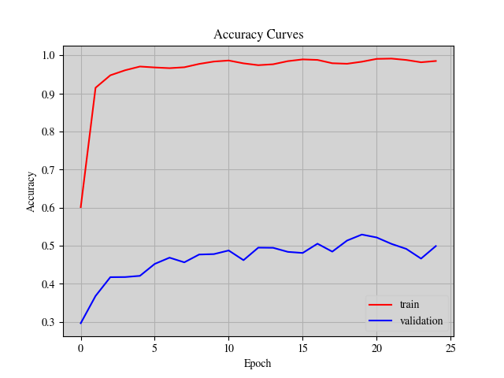
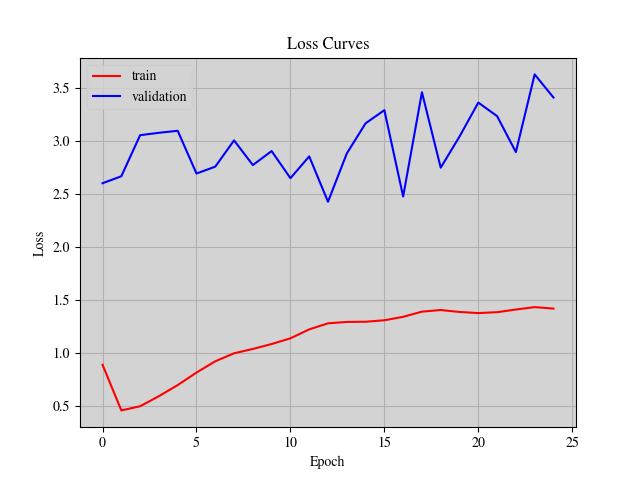

# Domain Adaptation With Domain-Adversarial Training of Neural Networks

This project adapts a classifier trained on a labeled source domain (MNIST) to a related but unlabeled target domain (SVHN) using Domain-Adversarial Training of Neural Networks (DANN). We use a pretrained RegNetY_400MF backbone, a gradient reversal layer (GRL), and a domain classifier to encourage domain-invariant features. Source images receive light on-the-fly augmentation; target images are transformed to the backbone’s expected normalization. SVHN test split is used as validation and test to monitor adaptation.


## Quickstart (Windows PowerShell)

The workflow is driven by the notebook `Domain_Adaptation_With_Domain_Adversarial_Training_of_Neural_Networks.ipynb`.

1. Create and activate a virtual environment

```pwsh
python -m venv .venv
./.venv/Scripts/Activate.ps1
```

1. Install PyTorch (choose command per your CUDA/CPU from pytorch.org)

   - Visit <https://pytorch.org/get-started/locally/> and install the matching `torch` and `torchvision` for your system.

1. Install Python dependencies used in the notebook

```pwsh
pip install -U lightning torchmetrics numpy scipy matplotlib pillow jupyter
```

1. Open and run the notebook

- VS Code: open `Domain_Adaptation_With_Domain_Adversarial_Training_of_Neural_Networks.ipynb` and Run All.
- Or Jupyter:

```pwsh
jupyter lab
# then open the notebook from the file browser and run all cells
```


## Data & Outputs

- The notebook automatically prepares the following structure under `experiment/`:
   - `experiment/dataset/DomainAdaptationDataset/raw/` with MNIST files (`train-images-idx3-ubyte`, `train-labels-idx1-ubyte`).
   - `experiment/dataset/` with SVHN `train_32x32.mat` and `test_32x32.mat` (downloaded by torchvision/urllib).
   - `experiment/model/DANN_best.ckpt` best checkpoint (saved by Lightning).
   - `experiment/training/DANN_acc_plot.png` and `experiment/training/DANN_loss_plot.png` training curves.

If you already have MNIST/SVHN locally, place them under `experiment/dataset/` as above and the loader will reuse them.


## Configuration

Key settings live near the top of the notebook:

- `IMAGE_SIZE = 32`, `BATCH_SIZE = 100`, `EPOCH = 50`, `NUM_CLASSES = 10`
- Optimizer: Adam with `LEARNING_RATE = 1e-3` and per-batch `CyclicLR`
- Early stopping: `EARLY_STOPPING_PATIENCE = 5` monitored on `val_acc`

Adjust as needed before running the Training cell.


## Train, Test, Inference

- Train: run the cell under “Training”. It will resume from `experiment/model/DANN_best.ckpt` if present.
- Test: run the “Testing” cell to evaluate the best checkpoint on SVHN test.
- Inference: run the “Inference” cell to visualize predictions on random SVHN test images.


## Results

The notebook saves curves on train/validation splits. Below are the latest artifacts from `experiment/training/` in this repo:



Accuracy curves on source (MNIST) and target (SVHN).



Loss curves on source (MNIST) and target (SVHN).

Quantitative metrics are reported in the notebook output (Validation/Test sections). Run the notebook to reproduce on your machine.


## What’s Updated in the Notebook Compared to Fork

- ImageNet normalization for both domains; moderated source augmentations for stability with a pretrained backbone.
- Gradient Reversal Layer updated to accept `lambda_` and a DANN schedule `$\lambda(p)=\tfrac{2}{1+e^{-10p}}-1$` based on global training progress.
- Domain losses are weighted by the scheduled `$\lambda$` while GRL uses `1.0`, matching the saddle-point updates for feature vs. domain heads.
- Feature dimension inferred from the backbone (`feat_dim = backbone.fc.in_features`) for both label and domain heads.
- TorchMetrics properly reset each epoch; EarlyStopping added on `val_acc`.
- Matplotlib plotting fixed to save and display figures reliably at train end.


## Credit

- [Domain-Adversarial Training of Neural Networks](https://arxiv.org/pdf/1505.07818.pdf)
- [Unsupervised Domain Adaptation by Backpropagation](http://sites.skoltech.ru/compvision/projects/grl/files/paper.pdf)
- [DANN](https://github.com/fungtion/DANN)
- [Designing Network Design Spaces](https://arxiv.org/pdf/2003.13678.pdf)
- [Reading Digits in Natural Images with Unsupervised Feature Learning](http://ufldl.stanford.edu/housenumbers/nips2011_housenumbers.pdf)
- [TorchVision’s SVHN](https://github.com/pytorch/vision/blob/main/torchvision/datasets/svhn.py)
- [Gradient-based learning applied to document recognition](https://ieeexplore.ieee.org/document/726791)
- [TorchVision’s MNIST](https://github.com/pytorch/vision/blob/main/torchvision/datasets/mnist.py)
- [Semi-supervision and domain adaptation with AdaMatch](https://keras.io/examples/vision/adamatch/)
- [PyTorch Lightning](https://lightning.ai/docs/pytorch/latest/)
